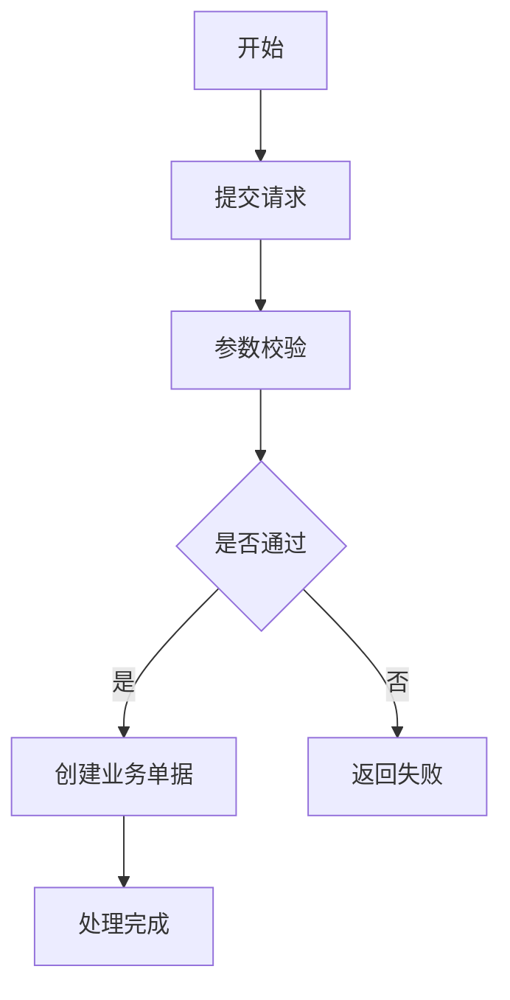
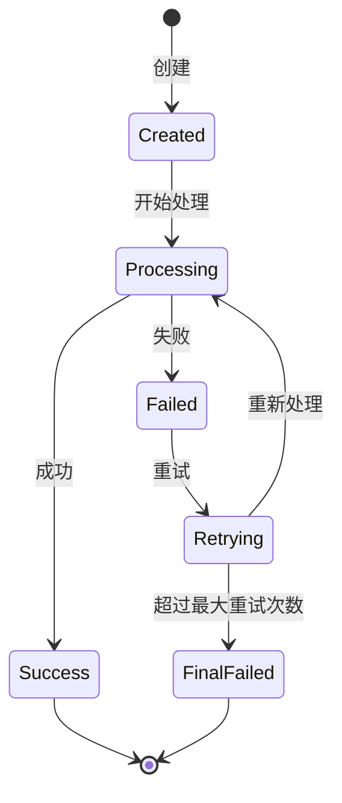
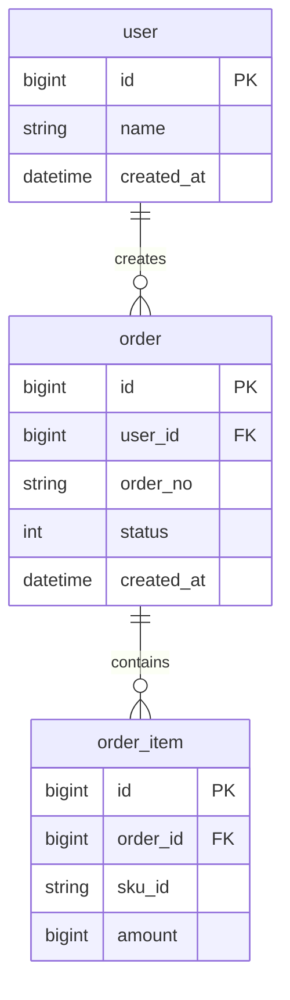
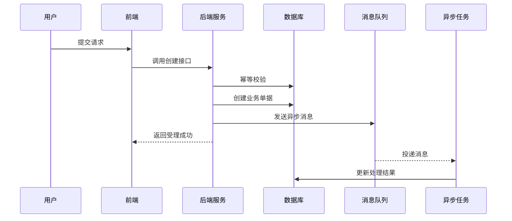
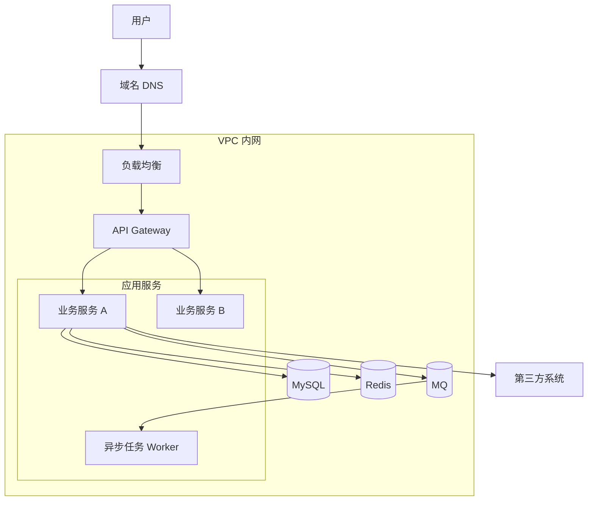

# 技术方案生成 Skill

## 1. Skill 名称

技术方案生成 Skill

## 2. 适用场景

本 Skill 用于将业务需求、PRD、口头需求、产品说明、系统改造诉求，转化为研发评审可用的技术方案文档。

适用于：

* 新功能技术方案
* 老系统改造方案
* 后端服务设计方案
* 中后台系统设计方案
* 支付、计费、结算、对账、风控、客服、消息、任务调度等业务系统设计
* PRD 转技术方案
* 技术评审前的方案初稿
* Codex / Claude Code 实施前的技术设计文档

不适用于：

* 纯产品方案
* 纯 UI 设计稿
* 不涉及系统设计的简单文案
* 已经明确要求直接写代码的任务

---

## 3. 输入要求

使用本 Skill 时，用户应尽量提供以下信息。

### 3.1 必要输入

* 需求背景
* 要解决的问题
* 目标功能
* 涉及角色
* 涉及系统或模块
* 当前系统现状
* 期望改造后的效果

### 3.2 可选输入

* PRD 文档
* 接口文档
* 数据库表结构
* 当前代码目录
* 现有系统架构
* 上下游依赖
* 性能要求
* 安全要求
* 上线时间
* 技术栈约束
* 部署环境
* 历史故障或风险点

### 3.3 信息不足时的处理原则

如果输入信息不足，不要直接编造确定结论。

应该：

1. 先列出“关键假设”。
2. 对不明确的问题标记为“待确认”。
3. 基于常见后端系统经验给出合理默认方案。
4. 在方案中明确哪些部分需要后续确认。
5. 不因为信息不完整而停止输出，除非用户明确要求先提问。

---

## 4. 输出目标

输出一份面向研发评审的技术方案文档。

文档必须包含：

* 背景与目标
* 需求理解
* 系统边界
* 总体架构
* 业务流程
* 技术架构
* 数据架构
* 接口设计
* 状态机设计
* 时序设计
* 部署架构
* 异常处理与补偿
* 幂等设计
* 数据一致性设计
* 安全与权限设计
* 监控与告警
* 灰度与回滚方案
* 风险与取舍
* 实施计划
* 验收标准
* 架构评审清单

所有图优先使用 Mermaid。

---

## 5. 输出风格

### 5.1 语言风格

* 使用中文。
* 面向研发、架构师、技术负责人。
* 不写营销化语言。
* 不写空泛表述。
* 尽量结合具体业务对象、状态、接口、表结构和异常场景。
* 重要设计要说明原因和取舍。

### 5.2 技术深度

技术方案必须体现：

* 系统边界
* 模块职责
* 数据流向
* 状态流转
* 幂等控制
* 异常补偿
* 数据一致性
* 扩展性
* 可观测性
* 安全性
* 可灰度
* 可回滚

### 5.3 Mermaid 规则

所有 Mermaid 图必须能直接渲染。

推荐图类型：

* 业务流程图：`flowchart TD`
* 技术架构图：`flowchart LR`
* 业务架构图：`flowchart TB`
* 数据架构图：`erDiagram`
* 部署架构图：`flowchart TB`
* 时序图：`sequenceDiagram`
* 状态机图：`stateDiagram-v2`

节点命名要求：

* 简洁
* 明确
* 不使用过长句子
* 不使用复杂特殊字符
* 避免 Mermaid 解析失败

---

## 6. 标准处理流程

执行本 Skill 时，按以下步骤处理。

### 第一步：需求理解

先从用户输入中提炼：

* 业务背景
* 当前问题
* 建设目标
* 核心角色
* 核心业务对象
* 核心流程
* 上下游系统
* 功能范围
* 非功能要求

输出“需求理解”时，需要区分：

* 已明确的信息
* 合理假设
* 待确认问题

---

### 第二步：定义系统边界

明确本方案负责什么，不负责什么。

必须输出：

* 本系统负责的能力
* 上游系统
* 下游系统
* 外部第三方系统
* 不在本期范围内的内容

示例：

```text
本系统负责：
- 接收业务请求
- 创建业务单据
- 管理状态流转
- 投递异步消息
- 执行补偿任务

本系统不负责：
- 用户登录认证
- 支付渠道清结算
- 第三方系统内部处理逻辑
```

---

### 第三步：设计总体架构

输出：

* 总体设计原则
* 核心模块划分
* 模块职责
* 同步调用关系
* 异步调用关系
* 数据存储关系
* 缓存使用策略
* 消息队列使用策略

必须包含技术架构图。

---

### 第四步：设计业务流程

输出：

* 主流程
* 异常流程
* 重试流程
* 补偿流程
* 人工处理流程，若有
* 业务流程图

业务流程图使用 Mermaid：



---

### 第五步：设计状态机

如果存在订单、任务、会话、工单、支付单、退款单、结算单、对账单等业务对象，必须设计状态机。

状态机必须包含：

* 初始状态
* 中间状态
* 成功终态
* 失败终态
* 取消状态，若适用
* 超时状态，若适用
* 补偿中状态，若适用

状态机图使用 Mermaid：



---

### 第六步：设计数据架构

必须输出：

* 核心实体
* 表结构设计
* 字段说明
* 主键设计
* 唯一约束
* 索引设计
* 状态字段
* 审计字段
* 幂等字段
* 数据生命周期
* 数据归档策略，若需要

表结构应优先包含：

```text
id
biz_no
status
idempotency_key
created_at
updated_at
deleted_at
version
remark
```

涉及金额时，必须说明：

* 金额字段类型
* 精度
* 币种
* 舍入策略
* 是否使用 int64 存储最小货币单位

涉及流水、账务、交易类系统时，必须优先考虑：

* append-only
* 不可变流水
* 幂等键
* 业务单号唯一约束
* 对账字段
* 状态流转记录

ER 图使用 Mermaid：



---

### 第七步：设计接口

必须输出：

* API 列表
* 接口职责
* 请求方式
* 请求路径
* 请求参数
* 响应参数
* 错误码
* 幂等策略
* 鉴权要求

接口设计要包含：

```text
POST /api/xxx/create
GET /api/xxx/detail
POST /api/xxx/cancel
POST /api/xxx/retry
```

对于写接口，必须说明：

* 幂等键来源
* 重复请求如何处理
* 并发请求如何处理
* 失败时是否可重试

---

### 第八步：设计时序图

核心链路必须输出时序图。

时序图需要体现：

* 用户
* 前端
* 后端服务
* 数据库
* Redis，若有
* MQ，若有
* 下游系统
* 第三方系统，若有

时序图使用 Mermaid：



---

### 第九步：设计异常处理与补偿

必须覆盖：

* 参数错误
* 重复请求
* 并发请求
* 数据库写入失败
* Redis 失败
* MQ 发送失败
* MQ 消费失败
* 下游接口超时
* 下游返回失败
* 第三方系统异常
* 任务执行超时
* 状态不一致
* 部分成功
* 重试多次失败
* 人工介入场景

每个异常场景需要说明：

* 失败点
* 影响范围
* 是否自动重试
* 是否进入补偿
* 是否需要告警
* 是否需要人工处理

---

### 第十步：设计幂等机制

必须说明：

* 哪些接口需要幂等
* 哪些消息需要幂等
* 哪些任务需要幂等
* 幂等键如何生成
* 幂等记录保存在哪里
* 幂等结果如何返回
* 并发情况下如何防重

常见幂等方案：

```text
1. 唯一索引防重
2. idempotency_key 表
3. 业务单号唯一约束
4. Redis 分布式锁
5. 状态机防重复推进
6. MQ 消费记录表
```

优先推荐：

```text
业务唯一键 + 数据库唯一索引 + 状态机判断
```

不要只依赖 Redis 锁作为最终幂等保障。

---

### 第十一步：设计数据一致性

根据系统复杂度说明一致性策略。

可选方案：

* 本地事务
* 事务消息
* Outbox Pattern
* Saga
* TCC
* 定时补偿
* 对账修复
* 最终一致性

必须说明：

* 哪些操作必须强一致
* 哪些操作可以最终一致
* 状态不一致时如何发现
* 状态不一致时如何修复
* 是否需要对账任务

---

### 第十二步：设计部署架构

必须输出：

* 部署环境
* 服务实例
* 网关
* 负载均衡
* 数据库
* 缓存
* 消息队列
* 定时任务
* 外部系统访问
* 网络边界
* 高可用策略
* 扩容策略

部署架构图使用 Mermaid：



---

### 第十三步：设计监控与告警

必须输出：

* 日志
* 指标
* 链路追踪
* 告警项
* 看板指标
* 排障入口

推荐指标：

```text
请求量
成功率
失败率
接口耗时
P95 / P99
MQ 堆积量
任务失败数
补偿任务数量
重试次数
状态卡住数量
数据库慢查询
第三方接口失败率
```

关键告警：

```text
核心接口失败率突增
MQ 消息堆积
补偿任务连续失败
状态长时间未推进
第三方接口超时
数据库连接异常
任务执行延迟
```

---

### 第十四步：设计灰度与回滚

必须说明：

* 是否支持灰度
* 灰度维度
* 配置开关
* 发布步骤
* 回滚步骤
* 数据回滚策略
* 兼容旧数据策略
* 是否需要双写
* 是否需要新老逻辑并行

常见灰度维度：

```text
用户 ID
租户 ID
商户 ID
渠道
地区
功能开关
流量比例
```

---

### 第十五步：输出风险与取舍

必须列出：

* 技术风险
* 业务风险
* 数据风险
* 性能风险
* 运维风险
* 安全风险
* 方案取舍

每个风险建议包含：

```text
风险描述
影响范围
风险等级
应对方案
是否需要提前验证
```

---

### 第十六步：输出实施计划

实施计划需要拆阶段：

```text
阶段一：方案评审
阶段二：表结构与接口设计
阶段三：核心功能开发
阶段四：联调
阶段五：测试
阶段六：灰度上线
阶段七：全量发布
阶段八：观察与复盘
```

每个阶段说明：

* 任务内容
* 负责人角色
* 产出物
* 验收标准

---

## 7. 技术方案标准模板

输出技术方案时，默认使用以下结构。

````markdown
# 技术方案：{方案名称}

## 1. 背景与目标

### 1.1 背景

### 1.2 当前问题

### 1.3 建设目标

### 1.4 非目标

---

## 2. 需求理解

### 2.1 核心业务流程

### 2.2 核心角色

### 2.3 核心业务对象

### 2.4 功能范围

### 2.5 非功能要求

### 2.6 关键假设

### 2.7 待确认问题

---

## 3. 系统边界

### 3.1 本系统负责

### 3.2 本系统不负责

### 3.3 上游系统

### 3.4 下游系统

### 3.5 外部依赖

---

## 4. 总体架构设计

### 4.1 设计原则

### 4.2 模块划分

### 4.3 核心模块职责

### 4.4 技术架构图

```mermaid
flowchart LR
````

---

## 5. 业务流程设计

### 5.1 主流程

### 5.2 异常流程

### 5.3 业务流程图

```mermaid
flowchart TD
```

---

## 6. 状态机设计

### 6.1 状态定义

### 6.2 状态流转规则

### 6.3 状态机图

```mermaid
stateDiagram-v2
```

---

## 7. 时序设计

### 7.1 核心链路说明

### 7.2 时序图

```mermaid
sequenceDiagram
```

---

## 8. 数据架构设计

### 8.1 核心实体

### 8.2 表结构设计

### 8.3 索引设计

### 8.4 唯一约束

### 8.5 数据生命周期

### 8.6 ER 图

```mermaid
erDiagram
```

---

## 9. 接口设计

### 9.1 API 列表

### 9.2 核心接口说明

### 9.3 请求参数

### 9.4 响应参数

### 9.5 错误码

### 9.6 幂等设计

---

## 10. 幂等设计

### 10.1 幂等场景

### 10.2 幂等键设计

### 10.3 并发防重

### 10.4 重复请求返回策略

---

## 11. 数据一致性设计

### 11.1 一致性要求

### 11.2 事务边界

### 11.3 最终一致性方案

### 11.4 对账与修复

---

## 12. 异常处理与补偿

### 12.1 异常场景

### 12.2 重试策略

### 12.3 补偿机制

### 12.4 人工介入

---

## 13. 部署架构设计

### 13.1 部署组件

### 13.2 网络访问关系

### 13.3 高可用设计

### 13.4 扩容方案

### 13.5 部署架构图

```mermaid
flowchart TB
```

---

## 14. 安全与权限设计

### 14.1 认证

### 14.2 鉴权

### 14.3 数据权限

### 14.4 敏感数据保护

---

## 15. 监控与告警

### 15.1 日志

### 15.2 指标

### 15.3 链路追踪

### 15.4 告警项

### 15.5 看板指标

---

## 16. 灰度与回滚

### 16.1 灰度策略

### 16.2 发布步骤

### 16.3 回滚方案

### 16.4 数据兼容

---

## 17. 风险与取舍

### 17.1 技术风险

### 17.2 业务风险

### 17.3 数据风险

### 17.4 运维风险

### 17.5 方案取舍

---

## 18. 实施计划

### 18.1 阶段划分

### 18.2 开发任务

### 18.3 联调计划

### 18.4 测试计划

### 18.5 上线计划

---

## 19. 验收标准

### 19.1 功能验收

### 19.2 性能验收

### 19.3 稳定性验收

### 19.4 运维验收

---

## 20. 架构评审清单

````

---

## 8. 架构评审清单

生成方案后，必须自检以下问题。

### 8.1 系统边界

- 系统负责范围是否清晰？
- 非目标是否明确？
- 上下游依赖是否明确？
- 是否存在职责混乱？

### 8.2 模块设计

- 模块拆分是否合理？
- 模块职责是否单一？
- 是否存在过度设计？
- 是否存在重复建设？

### 8.3 数据设计

- 表结构是否支持业务扩展？
- 主键是否合理？
- 唯一约束是否完整？
- 索引是否合理？
- 状态字段是否清晰？
- 是否需要流水表或历史表？
- 是否需要归档？

### 8.4 幂等与并发

- 写接口是否有幂等？
- MQ 消费是否有幂等？
- 定时任务是否有幂等？
- 并发操作是否会重复处理？
- 是否只依赖 Redis 锁？
- 数据库是否有最终防重约束？

### 8.5 一致性

- 事务边界是否清楚？
- 哪些地方强一致？
- 哪些地方最终一致？
- 失败后如何修复？
- 是否需要对账？
- 是否存在部分成功问题？

### 8.6 异常补偿

- 下游失败是否可重试？
- MQ 失败是否可恢复？
- 补偿任务是否幂等？
- 超过最大重试后如何处理？
- 是否有人工介入入口？

### 8.7 状态机

- 状态是否完整？
- 是否有终态？
- 失败状态是否可处理？
- 状态是否允许逆向流转？
- 状态卡住后如何发现？

### 8.8 可观测性

- 日志是否足够排查？
- 是否有核心指标？
- 是否有链路追踪？
- 是否有告警？
- 是否有运营或运维看板？

### 8.9 部署与稳定性

- 是否存在单点故障？
- 是否支持水平扩容？
- 是否有容量评估？
- 是否有降级方案？
- 是否有回滚方案？

### 8.10 安全

- 是否有认证？
- 是否有鉴权？
- 是否有数据权限？
- 敏感数据是否脱敏？
- 操作是否有审计日志？

---

## 9. 输出约束

执行本 Skill 时必须遵守：

1. 不要输出只有大纲的方案，除非用户明确要求只要大纲。
2. 不要省略关键图，除非该图与需求明显无关。
3. 不要用“根据实际情况处理”这类空话替代设计。
4. 不明确的信息必须放到“待确认问题”。
5. 所有关键设计必须说明取舍理由。
6. 所有图必须使用 Mermaid。
7. 方案必须面向研发落地，而不是产品介绍。
8. 涉及状态流转的业务对象必须输出状态机。
9. 涉及异步处理必须说明 MQ 幂等和补偿。
10. 涉及写接口必须说明幂等。
11. 涉及金额、账务、结算、对账必须特别说明精度、一致性、对账和不可变流水。
12. 涉及上线必须说明灰度、回滚和监控。

---

## 10. 默认输出提示词

当用户要求使用本 Skill 时，可使用以下默认提示词。

```text
你是资深后端架构师，请使用“技术方案生成 Skill”处理下面需求。

要求：
1. 输出一份完整技术方案。
2. 使用中文。
3. 面向研发评审。
4. 所有图使用 Mermaid。
5. 必须包含系统边界、技术架构、业务流程、数据架构、部署架构、状态机、时序图、接口设计、幂等、异常补偿、监控告警、灰度回滚、风险与实施计划。
6. 对不明确的信息，先列出关键假设和待确认问题。
7. 不要写空话，要结合具体业务场景。
8. 最后输出架构评审清单。

需求如下：

【在这里粘贴需求】
````

---

## 11. 适配 Codex / Claude Code 的使用方式

如果在代码仓库中使用，可这样调用：

```text
请读取 docs/prd/xxx.md，
并使用 .ai/skills/technical-design/SKILL.md，
生成 docs/design/xxx-technical-design.md。

要求：
1. 不修改业务代码。
2. 只新增或更新技术方案文档。
3. 所有图使用 Mermaid。
4. 最后给出本次生成内容摘要。
```

如果需要结合代码分析，可这样调用：

```text
请读取 docs/prd/xxx.md，
并参考当前代码仓库中的服务结构、接口、数据库相关代码，
使用 .ai/skills/technical-design/SKILL.md，
生成 docs/design/xxx-technical-design.md。

要求：
1. 先分析相关模块和文件。
2. 再生成技术方案。
3. 不修改业务代码。
4. 不做无关重构。
5. 对无法确认的信息标记为待确认。
```

---

## 12. 完成标准

一份由本 Skill 生成的技术方案，只有满足以下条件才算完成：

* 需求理解清晰
* 系统边界清晰
* 模块职责清晰
* 至少包含业务流程图、技术架构图、数据架构图、部署架构图
* 有状态机，若业务对象存在状态
* 有时序图，若存在跨系统调用
* 有表结构或核心数据模型
* 有接口设计
* 有幂等设计
* 有异常补偿设计
* 有数据一致性说明
* 有监控告警
* 有灰度和回滚
* 有风险与取舍
* 有实施计划
* 有验收标准
* 有架构评审清单

